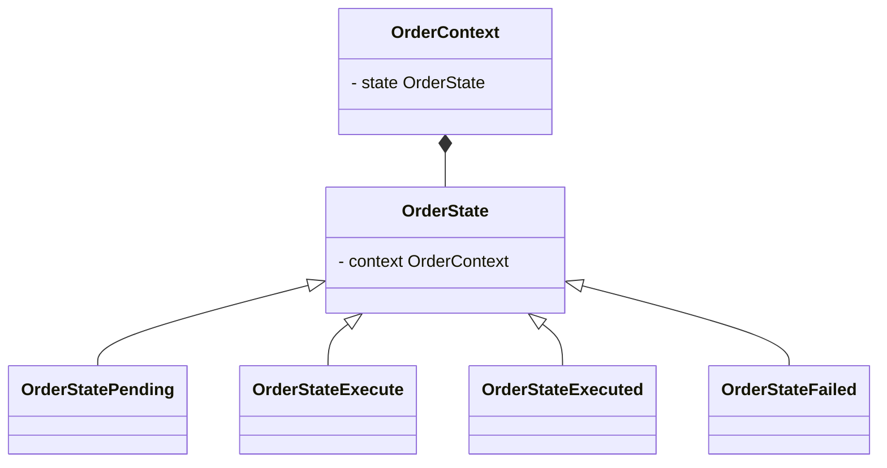
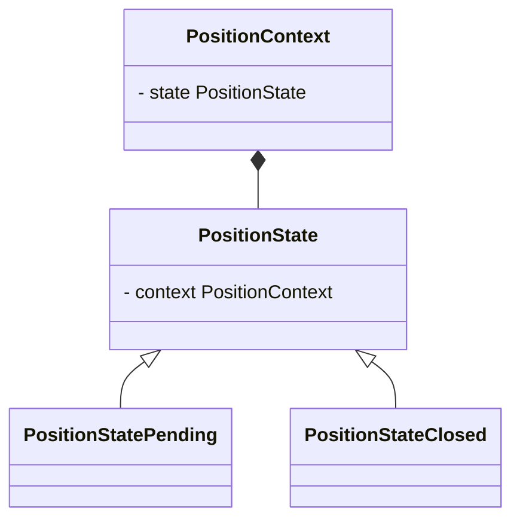

<div align="center">
    
    <h3 align="center">Aves Backend</h3>
    <p align="center">The Backend of the Aves Stack</p>
    <a align="center">Go to Full Stack Repo ➤</a>
</div>

<details open>
  <summary>Table of Contents</summary>
  <ol>
    <li>
      <a href="#about-the-project">About The Project</a>
      <ul>
        <li><a href="#built-with">Built With</a></li>
      </ul>
    </li>
    <li>
        <a href="#design-principles">Design Principles</a>
        <ul>
          <li><a href="#providers">Providers</a></li>
          <li><a href="#feeds">Feeds</a></li>
          <li><a href="#coordinators">Coordinators</a></li>
          <li>
            <a href="#logical-components">Logical Components</a>
            <ul>
              <li><a href="#order-component">Order Component</a></li>
              <li><a href="#position-component">Position Component</a></li>
            </ul>
          </li>
        </ul>
    </li>
    <li>
      <a href="#getting-started">Getting Started</a>
      <ul>
        <li>
          <a href="#prerequisites">Prerequisites</a>
          <ul>
            <li><a href="#network-bridge">Network Bridge</a></li>
            <li><a href="#mongodb">MongoDB</a></li>
          </ul>
        </li>
      </ul>
    </li>
    <li>
      <a href="#usage">Usage</a>
      <ul>
        <li><a href="#configuration">Configuration</a></li>
        <li><a href="#running-a-container">Running a Container</a></li>
        <li><a href="#endpoints">Endpoints</a></li>
        <li>
          <a href="#websocket-connections">Websocket Connections</a>
          <ul>
            <li><a href="#topics">Topics</a></li>
            <li><a href="#order-event">Order Event</a></li>
            <li><a href="#position-event">Position Event</a></li>
              <li><a href="#operation-request">Operation Request</a></li>
              <li><a href="#operation-response">Operation Response</a></li>
            <li><a href="#subscribe">Subscribe</a></li>
            <li><a href="#unsubscribe">Unsubscribe</a></li>
          </ul>
        </li>
      </ul>
    </li>
    <!--
    <li><a href="#roadmap">Roadmap</a></li>
    <li><a href="#contributing">Contributing</a></li>
    <li><a href="#license">License</a></li>
    <li><a href="#contact">Contact</a></li>
    -->
    <li><a href="#acknowledgements">Acknowledgements</a></li>
  </ol>
</details>


## About The Project

Aves is a full stack web environment implementing a system for Statistical Arbitrage for the bybit crypto exchange. The user can place market, limit and stop orders on market pairs (e.g. BTCUSDT-ETHUSDT). These are then executed and a beta neutral position is created on the bybit exchange consisting of two opposing positions on the given markets.

The system uses a simple OLS regression model to fit a simple linear function without an intercept between the prices of two given markets:

$$Y = \beta X + \epsilon$$

The residual $\epsilon$ will represent the price value discrepancy of the first market $Y$ relative to the price value of the second market $X$.

This repository implements the core logic of the Aves Stack. It provides a simple RESTful API for creation/deletion/fetching of order or position data as well as a websocket API with a simple pubsub pattern for order and position updates.

### Built With

* [![Docker][docker]](https://www.docker.com/)
* [![NPM][npm]](https://www.npmjs.com/)
* [![PNPM][pnpm]](https://pnpm.io/)
* [![Node][Node.js]](https://nodejs.org/)
* [![Typescript][typescript]](https://www.typescriptlang.org/)
* [![Vitest][vitest]](https://vitest.dev/)
* [![Mongoose][mongoose]](https://mongoosejs.com/)
* [![Express][express.js]](https://expressjs.com/)
* [![Passport][passport]](https://www.passportjs.org/)
* [![Google][google-cloud]](https://cloud.google.com/)

## Design Principles

The core logic is implemented with the following design principles:

### Providers

Providers are broad classes that manage data fetching from the bybit exchange API and/or the creation and lifecycle of unique logical modules like order contexts and position contexts that must have only one global instance. They have a .get(params) function where the function parameters are used to identify the market data or module instance to select.

### Feeds

Feeds are event emitters that emit either market data or a function of market data itself (profit and loss is a function of the current price and the currently holding position size).

### Coordinators

Coordinators manage the creation and deletion of corresponding logical component instances.

### Logical Components

#### Order Component

A simple finite state machine for the life cycle of an order that interacts with bybits exchange API. It manages a corresponding database document containing current order data.



#### Position Component

A simple finite state machine for the life cycle of a position that interacts with bybits exchange API. It manages a corresponding database document containing current position data.



## Getting Started

It is recommended to install the full stack docker composition if you want just the app:

<div align="center">
  <a align="center">Go to Full Stack Repo ➤</a>
</div>

### Prerequisites

Make sure you have docker installed.

#### Network Bridge

A network bridge between MongoDB and aves-api is needed. Create one with the following command:

`docker network create aves-service`

#### MongoDB

If your machine is not running a MongoDB instance, start a docker container with the following command:

`docker run -p 27017:27017 --network=aves-service --name mongodb -d mongo:latest`

If you want persisting data between docker container restarts run a container with a volume:

`docker volume create mongodbdata`

`docker run -p 27017:27017 -v mongodbdata:/data/db --network=aves-service --name mongodb -d mongo:latest`

## Usage

### Configuration

The app is requiring the following environment variables:

| name | description | default | required |
|:---|:---|:---|:---|
| ENVIRONMENT | `dev` for debug mode and `start` for distribution mode | `start` | true |
| PORT | port the express server will be listening to | 4000 | true |
| SESSION_SECRET | session secret for the express session middleware (usage of a random generated keygen is recommended) | - | true
| JSON_WEB_TOKEN_SECRET | secret for jwt authentication (usage of a random generated key is recommended) | - | true |
| JSON_WEB_TOKEN_EXPIRES_IN | duration in seconds a generated json web token is valid (a authenticated user becomes unauthenticated after) | 600 | true |
| JSON_WEB_TOKEN_REFRESH_SECRET | secret for jwt authentication refresh token (usage of a random generated key is recommended) | - | true |
| JSON_WEB_TOKEN_REFRESH_EXPIRES_IN | duration in seconds a generated refresh token is valid | 86400 | true |
| GOOGLE_OAUTH_CLIENT_ID | Client id of your google oauth2 credentials. Obtain one here: [https://console.cloud.google.com/apis/credentials](https://console.cloud.google.com/apis/credentials) | - | true |
| MONGODB_PORT | port to the locally running MongoDB service | 27017 | true |
| MONGODB_DB_NAME | name of the MongoDB database this app should use | aves | true |
| MONGOOSE_USER | MongoDB user name to use for connection establishment | - | false |
| MONGOOSE_PASS | MongoDB user password to use for connection establishment | - | false |
| MONGOOSE_AUTH_SOURCE | MongoDB authentication database (admin, user) | - | false |
| BYBIT_INSTRUMENTS_INFO_REFETCH_INTERVAL_HOURS | interval time in hours for refetching information for bybits instruments (see [Bybit API - Instruments Info](https://bybit-exchange.github.io/docs/v5/market/instrument)) | 24 | true |
| POSITION_PNL_UPDATE_INTERVAL_MS | interval time in milliseconds for profit and loss recalculation | 5000 | true |

> **_NOTE_** `SESSION_SECRET` and `JSON_WEB_TOKEN_SECRET` must be provided by the user under all circumstances. Provide `MONGOOSE_USER` and `MONGOOSE_PASS` if your MongoDB server has role based authentication enabled.

### Running a Container

To run a container use the following command:

`docker run -e ENVIRONMENT=start -e SESSION_SECRET=<secret> -e JSON_WEB_TOKEN_SECRET=<jwt-secret> -e JSON_WEB_TOKEN_REFRESH_SECRET=<jwtr-secret> -e GOOGLE_OAUTH_CLIENT_ID=<client_id> -e INITIAL_ADMIN_EMAIL_ADDRESS=<email-address> -e PORT=<port> -p <port>:<port> --network=aves-service --name aves-api jaju0/aves-api:latest`

Replace the `<...>` parts with your data/preferred settings. You can add additional environment variables from the table above with dockers `-e` argument.

### Endpoints

The root path of all most up to date rest API endpoints is currently `/v1`.
For details about the endpoints see [OpenAPI definition](https://petstore.swagger.io/?url=https://raw.githubusercontent.com/jaju0/aves_api/develop/docs/openapi-3.1.0.yml).

> **_NOTE_** Not all users have access to all endpoints. Each user has got a rank: `ADMIN`, `USER` or `NONE`. If the user is not authorized for a specific endpoint the http status code `403 (Forbidden)` is sent.

### Websocket Connections

Connections to the websocket server can be established over the `/ws` endpoint. An access token for user authentication must be sent via a query parameter: `/ws?token=...`. Unauthenticated connections will be immediately closed with the close code `1008`.

The websocket server provides a simple pubsub pattern and sends update data for specific topics.

#### Topics

| topic name | description |
|:---|:---|
| order | sends order data after change |
| position | sends position data after change |

#### Order Event

Expect a message of the follwing kind at any time after subscribing to the order topic:

Example:
```json
{
  "ownerId": "6647d82feee6930865e2de27",
  "status": "Pending",
  "type": "Limit",
  "side": "Buy",
  "symbol1": "BTCUSDT",
  "symbol2": "ETHUSDT",
  "symbol1BaseQty": "0.001",
  "symbol2BaseQty": "0.01",
  "quoteQty": "100",
  "entryResidual": "-0.023",
  "regressionSlope": "10.23",
  "takeProfit": "0.1",
  "stopLoss": "-0.01"
}
```

| property | type | description |
|:---|:---|:---|
| ownerId | `string` (ObjectId) | Id of the user the order belongs to. |
| status | `string` ("New", "Pending", "Execute", "Executed", "Failed") | Status of the order |
| type | `string` ("Market", "Limit", "Stop") | Type of the order. |
| side | `string` ("Buy", "Sell") | Side of the order. |
| symbol1 | `string` | Instruments symbol for the first market ($Y$) |
| symbol2 | `string` | Instruments symbol for the second market ($X$) |
| symbol1BaseQty | `string` (decimal) | Base quantity of the order of the first instrument. |
| symbol2BaseQty | `string` (decimal) | Base quantity of the order of the second instrument. |
| quoteQty | `string` (decimal) or `undefined` | Quote quantity used for the orders. |
| entryResidual | `string` (decimal) or `undefined` | Residual trigger threshold for the calculated residuals $\epsilon$. The order will be executed if it reached the threshold. Only for Limit and Stop orders. |
| regressionSlope | `string` (decimal) | Regression slope $\beta$ for calculating the residuals $\epsilon$. |
| takeProfit | `string` (decimal) or `undefined` | Take profit residual threshold. Position will be closed after reaching the take profit residual threshold |
| stopLoss | `string` (decimal) or `undefined` | Stop loss residual threshold. Position will be closed after reaching the stop loss threshold. |

#### Position Event

Expect a message of the follwing kind at any time after subscribing to the position topic:

Example:
```json
{
  "ownerId": "6647d82feee6930865e2de27",
  "side": "Buy",
  "symbol1": "BTCUSDT",
  "symbol2": "ETHUSDT",
  "symbol1EntryPrice": "60342.23",
  "symbol2EntryPrice": "3034.33",
  "symbol1BaseQty": "0.001",
  "symbol2BaseQty": "0.01",
  "lastPnl": "0.32",
  "regressionSlope": "10.23",
  "takeProfit": "0.1",
  "stopLoss": "-0.01"
}
```

| property | type | description |
|:---|:---|:---|
| ownerId | `string` (ObjectId) | Id of the user the position belongs to. |
| side | `string` ("Buy", "Sell") | Side of the position. |
| symbol1 | `string` | Instruments symbol of the first market ($Y$) |
| symbol2 | `string` | Instruments symbol of the second market ($X$) |
| symbol1EntryPrice | `string` (decimal) | first markets entry price |
| symbol2EntryPrice | `string` (decimal) | second markets entry price |
| symbol1BaseQty | `string` (decimal) | Base quantity of the position of the first instrument. |
| symbol2BaseQty | `string` (decimal) | Base quantity of the position of the second instrument. |
| lastPnl | `string` (decimal) | last calculated profit or loss |
| regressionSlope | `string` (decimal) | Regression slope $\beta$ the position uses. |
| takeProfit | `string` (decimal) or `undefined` | Take profit residual threshold. Position will be closed after reaching the take profit residual threshold |
| stopLoss | `string` (decimal) or `undefined` | Stop loss residual threshold. Position will be closed after reaching the stop loss threshold. |

#### Operation Request

Operation Requests can be made with an JSON object of the following structure:

| property | type | description |
|:---|:---|:---|
| reqId | string | A client defined ID for identifying responses with their corresponding request. Can be anything that is a string. |
| op | string ("subscribe", "unsubscribe") | operation to execute |
| args | array | array of arguments the operation expects |

#### Operation Response

Expect an operation response with the following structure after sending an operation request:

| property | type | description |
|:---|:---|:---|
| reqId | string | A client defined ID for assigning the response to a request. |
| op | string | The operation of the corresponding request |
| success | boolean | Operation success |
| status | string | operation success status text |

#### Subscribe

Subscribe operations args property takes a string array of topics.

Send the following message to subscribe to the order topic (reqId is optional):

```json
{
  "reqId": "custom_req_id",
  "op": "subscribe",
  "args": ["order"]
}
```

Expect the following answer from the server:

```json
{
  "reqId": "custom_req_id",
  "op": "subscribe",
  "success": true,
  "status": "subscribed to topic(s)"
}
```

#### Unsubscribe

Send the following message to unsubscribe from a topic (reqId is optional):

```json
{
  "reqId": "custom_req_id",
  "op": "unsubscribe",
  "args": ["order"]
}
```

Expect the following answer from the server:

```json
{
  "reqId": "custom_req_id",
  "op": "subscribe",
  "success": true,
  "status": "subscribed to topic(s)"
}
```

## Acknowledgements

<a href="https://www.flaticon.com/free-icons/eagle" title="eagle icons">Eagle icons created by Culmbio - Flaticon</a>


[docker]: https://img.shields.io/badge/docker-white?style=for-the-badge&logo=docker
[npm]: https://img.shields.io/badge/npm-white?style=for-the-badge&logo=npm
[pnpm]: https://img.shields.io/badge/pnpm-white?style=for-the-badge&logo=pnpm
[Node.js]: https://img.shields.io/badge/Node.js-white?style=for-the-badge&logo=node.js
[typescript]: https://img.shields.io/badge/Typescript-white?style=for-the-badge&logo=typescript
[vitest]: https://img.shields.io/badge/Vitest-white?style=for-the-badge&logo=vitest
[mongoose]: https://img.shields.io/badge/Mongoose-black?style=for-the-badge&logo=mongoose
[express.js]: https://img.shields.io/badge/Express.js-black?style=for-the-badge&logo=express
[passport]: https://img.shields.io/badge/passport-white?style=for-the-badge&logo=passport
[google-cloud]: https://img.shields.io/badge/google%20cloud-white?style=for-the-badge&logo=google